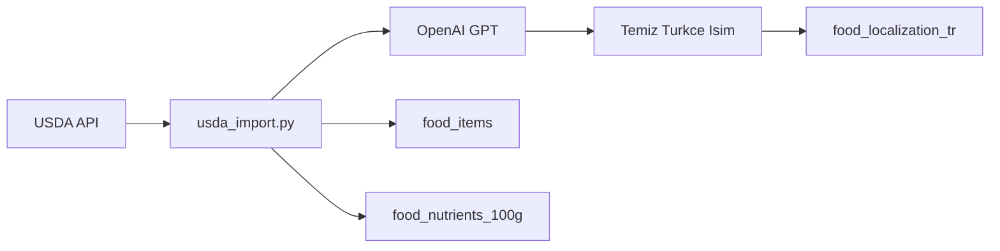

# Turkce Besin Veritabani Cozumu

## Sorun Analizi


| Kaynak               | Avantaj                      | Dezavantaj                       |
| -------------------- | ---------------------------- | -------------------------------- |
| **TurKomp**          | Turkce, resmi                | API yok, siteye erisim zor       |
| **OpenFoodFacts TR** | API var, acik kaynak         | Sadece ~2,659 urun, cogu paketli |
| **USDA**             | 300K+ besin, guvenilir macro | Ingilizce, karmasik isimler      |


**Oneri:** USDA + AI ceviri/temizleme (en pratik ve olceklenebilir cozum)

---

## Cozum: AI-Powered Turkce Cevirili Import

### Mimari




### 1. Script Guncellemesi

**Dosya:** [scripts/usda_import.py](scripts/usda_import.py)

Yeni ozellikler:

- `--translate` flag'i ekle (varsayilan: True)
- Her besin icin GPT'ye istek at:
  - Ingilizce ismi Turkce'ye cevir
  - Karmasik isimleri temizle/sadelelestir
  - Arama icin alias'lar uret

**GPT Prompt ornegi:**

```
Besinin Ingilizce ismi: "Chicken, broiler, breast, skinless, boneless, meat, raw"
1. Turkce temiz isim (max 40 karakter): 
2. Kisa aciklama:
3. Arama alias'lari (virgulla ayrilmis):
JSON formatinda don.
```

**Beklenen cikti:**

```json
{
  "name_tr": "Tavuk Gogsu (Derisiz, Cig)",
  "description_tr": "Derisiz, kemiksiz tavuk gogsu eti, pisirilmemis",
  "aliases_tr": ["tavuk", "gogus", "piliç", "chicken breast"]
}
```

### 2. Veritabani Guncellemesi

`food_localization_tr` tablosu zaten mevcut:

- `name_tr`: Temiz Turkce isim
- `aliases_tr`: Arama terimleri (array)

Yeni kolon ekle:

```sql
ALTER TABLE food_localization_tr 
ADD COLUMN IF NOT EXISTS description_tr TEXT;
```

### 3. Import Akisi

1. USDA'dan besin verisi cek
2. Her besin icin:
  - `food_items` + `food_nutrients_100g`'ye macro verisi yaz
  - GPT'ye Ingilizce isim gonder
  - Turkce ceviriyi `food_localization_tr`'ye yaz
3. Rate limiting: GPT API icin 0.5s bekleme (maliyet kontrolu)

### 4. Maliyet Tahmini

- GPT-4o-mini: ~$0.15/1M input token, ~$0.60/1M output token
- Her besin ~100 token = ~$0.00006
- 500 besin import = ~$0.03 (cok dusuk)

### 5. Ornek Kullanim

```bash
# Turkce ceviri ile import
python3 scripts/usda_import.py --search "chicken" --limit 20 --translate

# Sadece macro verisi (ceviri yok)
python3 scripts/usda_import.py --search "chicken" --limit 20 --no-translate
```

---

## Alternatif: Manuel Kurasyon Listesi

AI ceviri yerine/ile birlikte, fitness'ta en cok kullanilan ~100 besini manuel hazirla:

**Kategoriler:**

- Proteinler: Tavuk, hindi, dana, yumurta, balik...
- Karbonhidratlar: Pirinc, makarna, ekmek, yulaf...
- Sebzeler: Brokoli, ispanak, domates...
- Meyveler: Muz, elma, portakal...
- Surupler: Sut, yogurt, peynir...

Bu listeyi JSON/CSV olarak hazirla, tek seferde import et.

---

## Sonraki Adimlar

1. `scripts/usda_import.py`'ye GPT entegrasyonu ekle
2. `--translate` parametresi ekle
3. `food_localization_tr.description_tr` kolonu ekle
4. Yaygin besinleri import et (tavuk, yumurta, pirinc, vb.)
5. Admin panelde arama/secim UI'i guncelle

